# Hardware Block Diagram

This diagram reflects the current SCC control-platform firmware layout:

- Arduino Uno owns the thermal control loop, sensor readout, heater PWM, and pump/motor PWM.
- ESP32 acts as the communications bridge between the Arduino UART and the local MQTT/backend stack.
- Arduino-over-UART OTA reset wiring is optional scaffolding and does not currently flash Arduino firmware.

```mermaid
%%{init: {"theme": "base", "themeVariables": {"background": "#0b0f14", "mainBkg": "#121821", "secondBkg": "#0f151d", "primaryColor": "#121821", "primaryTextColor": "#e5e7eb", "primaryBorderColor": "#1f2937", "lineColor": "#64748b", "secondaryColor": "#0f151d", "tertiaryColor": "#101923", "fontFamily": "Inter, IBM Plex Sans, ui-sans-serif, system-ui, sans-serif", "edgeLabelBackground": "#0b0f14", "clusterBkg": "#0f151d", "clusterBorder": "#1f2937", "titleColor": "#e5e7eb", "nodeTextColor": "#e5e7eb"}}}%%
flowchart LR
  subgraph Rig["Thermal SCC / Corrosion Test Rig"]
    Bath["MgCl2 bath / specimen cell"]
    TempSensor["Temperature sensor / thermistor interface"]
    Heater["Heater element"]
    Pump["Pump / dosing motor"]
  end

  subgraph Power["Power Domains"]
    Logic5V["5 V logic supply"]
    Logic33V["3.3 V ESP32 supply"]
    LoadSupply["Load supply for heater and pump"]
  end

  subgraph Arduino["Arduino Uno SCC Controller"]
    A0["A0 THERM_PIN\nADC temperature input"]
    D6["D6 HEATER_PWM_PIN\nPWM heater command"]
    D9["D9 MOTOR_PIN\nPWM pump/motor command"]
    Serial0["UART Serial @ 115200\nCSV telemetry + commands"]
    Control["Autotune / PID / safety logic\n120-130 C safe window\nheater hard kill at 130 C"]
  end

  subgraph DriverStage["Power Driver Stage"]
    HeaterMosfet["Heater MOSFET / driver"]
    MotorDriver["Motor driver / MOSFET"]
  end

  subgraph ESP32["ESP32 Relay / Communications Bridge"]
    Uart2["UART2\nRX GPIO16 / TX GPIO17\n115200 baud"]
    Wifi["Wi-Fi station"]
    MqttClient["MQTT publisher"]
    CommandPoller["HTTP command poller\nKILL / SET_ON / OTA / ARDUINO_OTA"]
    EspOta["ESP32 OTA updater"]
    ResetGpio["Optional Arduino RESET GPIO\nactive low"]
  end

  subgraph LocalStack["Local Computer / Backend Stack"]
    Mosquitto["Mosquitto MQTT broker\nmqtt://LAN_IP:1883"]
    Flask["Flask backend\nMQTT subscriber + command API"]
    Postgres["PostgreSQL"]
    HMI["React HMI dashboard"]
  end

  Bath --> TempSensor
  TempSensor -->|"analog temperature signal"| A0
  A0 --> Control
  Control --> D6
  Control --> D9
  D6 -->|"PWM, max 200/255"| HeaterMosfet
  D9 -->|"PWM: startup 180, run 155"| MotorDriver
  HeaterMosfet -->|"switched load power"| Heater
  MotorDriver -->|"switched load power"| Pump
  Heater --> Bath
  Pump --> Bath

  Serial0 <-->|"CSV telemetry upstream\ncommand lines downstream"| Uart2
  ResetGpio -.->|"optional reset pulse for future Arduino OTA"| Serial0

  Uart2 --> MqttClient
  Wifi --> MqttClient
  Wifi --> CommandPoller
  Wifi --> EspOta
  MqttClient -->|"scc/site/site_id/rig/rig_id/device/device_id/telemetry"| Mosquitto
  CommandPoller <-->|"HTTP polling / command JSON"| Flask
  Mosquitto --> Flask
  Flask --> Postgres
  HMI <-->|"HTTP polling"| Flask

  Logic5V --> Arduino
  Logic33V --> ESP32
  LoadSupply --> HeaterMosfet
  LoadSupply --> MotorDriver

  classDef field fill:#0f151d,stroke:#22c55e,color:#e5e7eb,stroke-width:1px;
  classDef controller fill:#121821,stroke:#38bdf8,color:#e5e7eb,stroke-width:1px;
  classDef safety fill:#121821,stroke:#ef4444,color:#e5e7eb,stroke-width:1px;
  classDef comm fill:#101923,stroke:#38bdf8,color:#e5e7eb,stroke-width:1px;
  classDef backend fill:#121821,stroke:#64748b,color:#e5e7eb,stroke-width:1px;
  classDef driver fill:#0f151d,stroke:#f59e0b,color:#e5e7eb,stroke-width:1px;
  classDef power fill:#0f151d,stroke:#f59e0b,color:#e5e7eb,stroke-width:1px;

  class Bath,TempSensor,Heater,Pump field;
  class A0,D6,D9,Serial0 controller;
  class Control safety;
  class HeaterMosfet,MotorDriver driver;
  class Uart2,Wifi,MqttClient,CommandPoller,EspOta,ResetGpio comm;
  class Mosquitto,Flask,Postgres,HMI backend;
  class Logic5V,Logic33V,LoadSupply power;

  style Rig fill:#0f151d,stroke:#1f2937,color:#e5e7eb
  style Power fill:#0b1118,stroke:#f59e0b,color:#e5e7eb
  style Arduino fill:#0f151d,stroke:#38bdf8,color:#e5e7eb
  style DriverStage fill:#0b1118,stroke:#f59e0b,color:#e5e7eb
  style ESP32 fill:#0f151d,stroke:#38bdf8,color:#e5e7eb
  style LocalStack fill:#0f151d,stroke:#64748b,color:#e5e7eb
```



## Pin And Signal Summary

| Endpoint | Signal | Notes |
| --- | --- | --- |
| Arduino A0 | Temperature ADC | Uses calibrated linear fit in firmware: `tempC = -0.1871 * adc + 167.97`. |
| Arduino D6 | Heater PWM | Drives heater MOSFET/driver. Firmware clamps heater PWM to `HEATER_PWM_MAX = 200`. |
| Arduino D9 | Pump/motor PWM | Drives pump/motor driver. Startup kick is `180`, normal PWM is `155`. |
| Arduino Serial | UART telemetry/commands | CSV telemetry is emitted at `115200` baud. Optional command handling supports bootloader prep when enabled. |
| ESP32 GPIO16 | UART2 RX | Receives Arduino TX telemetry. |
| ESP32 GPIO17 | UART2 TX | Sends backend command lines to Arduino. |
| ESP32 configured GPIO | Optional Arduino RESET | Only used when `ARDUINO_RESET_GPIO >= 0`; active-low reset pulse for future Arduino OTA scaffolding. |
| ESP32 Wi-Fi | MQTT + HTTP + OTA | Publishes telemetry to local MQTT, polls backend commands, and supports ESP32 OTA. |

## Backend Interface

Telemetry is published by the ESP32 to:

```text
scc/site/<site_id>/rig/<rig_id>/device/<device_id>/telemetry
```

The backend stores raw telemetry first, then derives alarms, pump cycles, ML predictions, and MPC advisory state for the HMI.
