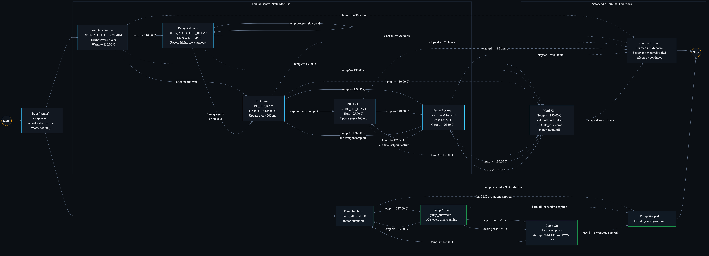

# State Machine Diagram

This diagram reflects the Arduino SCC controller firmware state flow in
`firmware/arduino/SCC-V1.4/src/controller.cpp` and
`firmware/arduino/SCC-V1.4/src/main.cpp`.

```mermaid
%%{init: {"theme": "base", "themeVariables": {"background": "#0b0f14", "mainBkg": "#121821", "secondBkg": "#0b0f14", "primaryColor": "#121821", "primaryTextColor": "#e5e7eb", "primaryBorderColor": "#1f2937", "lineColor": "#64748b", "secondaryColor": "#0b0f14", "tertiaryColor": "#0b0f14", "fontFamily": "Inter, IBM Plex Sans, ui-sans-serif, system-ui, sans-serif", "edgeLabelBackground": "#0b0f14", "clusterBkg": "#0b0f14", "clusterBorder": "#1f2937", "titleColor": "#e5e7eb", "nodeTextColor": "#e5e7eb"}}}%%
flowchart LR
  Start((Start)) --> Boot["Boot / setup()\nOutputs off\nmotorEnabled = true\nresetAutotune()"]

  subgraph Thermal["Thermal Control State Machine"]
    Warmup["Autotune Warmup\nCTRL_AUTOTUNE_WARMUP\nHeater PWM = 200\nWarm to 110.00 C"]
    Relay["Relay Autotune\nCTRL_AUTOTUNE_RELAY\n115.00 C +/- 1.20 C\nRecord highs, lows, periods"]
    Ramp["PID Ramp\nCTRL_PID_RAMP\n115.00 C -> 125.00 C\nUpdate every 700 ms"]
    Hold["PID Hold\nCTRL_PID_HOLD\nHold 125.00 C\nUpdate every 700 ms"]
    Lockout["Heater Lockout\nHeater PWM forced 0\nSet at 128.50 C\nClear at 126.50 C"]

    Warmup -->|"temp >= 110.00 C"| Relay
    Warmup -->|"autotune timeout"| Ramp
    Relay -->|"5 relay cycles\nor timeout"| Ramp
    Relay -->|"temp crosses relay band"| Relay
    Ramp -->|"setpoint ramp complete"| Hold
    Ramp -->|"temp >= 128.50 C"| Lockout
    Hold -->|"temp >= 128.50 C"| Lockout
    Lockout -->|"temp <= 126.50 C\nand ramp incomplete"| Ramp
    Lockout -->|"temp <= 126.50 C\nand final setpoint active"| Hold
  end

  Boot --> Warmup

  subgraph Pump["Pump Scheduler State Machine"]
    PumpInhibited["Pump Inhibited\npump_allowed = 0\nmotor output off"]
    PumpArmed["Pump Armed\npump_allowed = 1\n30 s cycle timer running"]
    PumpOn["Pump On\n1 s dosing pulse\nstartup PWM 180, run PWM 155"]
    PumpStopped["Pump Stopped\nforced by safety/runtime"]

    PumpInhibited -->|"temp >= 127.00 C"| PumpArmed
    PumpArmed -->|"cycle phase < 1 s"| PumpOn
    PumpOn -->|"cycle phase >= 1 s"| PumpArmed
    PumpArmed -->|"temp <= 123.00 C"| PumpInhibited
    PumpOn -->|"temp <= 123.00 C"| PumpInhibited
  end

  Boot --> PumpInhibited

  subgraph Overrides["Safety And Terminal Overrides"]
    HardKill["Hard Kill\nTemp >= 130.00 C\nheater off, lockout set\nPID integral cleared\nmotor output off"]
    RuntimeExpired["Runtime Expired\nElapsed >= 96 hours\nheater and motor disabled\ntelemetry continues"]
    Stop((Stop))
  end

  Warmup -.->|"temp >= 130.00 C"| HardKill
  Relay -.->|"temp >= 130.00 C"| HardKill
  Ramp -.->|"temp >= 130.00 C"| HardKill
  Hold -.->|"temp >= 130.00 C"| HardKill
  Lockout -.->|"temp >= 130.00 C"| HardKill
  HardKill -->|"temp < 130.00 C"| Lockout

  Warmup -.->|"elapsed >= 96 hours"| RuntimeExpired
  Relay -.->|"elapsed >= 96 hours"| RuntimeExpired
  Ramp -.->|"elapsed >= 96 hours"| RuntimeExpired
  Hold -.->|"elapsed >= 96 hours"| RuntimeExpired
  Lockout -.->|"elapsed >= 96 hours"| RuntimeExpired
  HardKill -.->|"elapsed >= 96 hours"| RuntimeExpired
  PumpInhibited -.->|"hard kill or runtime expired"| PumpStopped
  PumpArmed -.->|"hard kill or runtime expired"| PumpStopped
  PumpOn -.->|"hard kill or runtime expired"| PumpStopped
  RuntimeExpired --> Stop
  PumpStopped --> Stop

  classDef normal fill:#121821,stroke:#38bdf8,color:#e5e7eb,stroke-width:1px;
  classDef pump fill:#101923,stroke:#22c55e,color:#e5e7eb,stroke-width:1px;
  classDef safety fill:#121821,stroke:#ef4444,color:#e5e7eb,stroke-width:1px;
  classDef terminal fill:#0f151d,stroke:#64748b,color:#e5e7eb,stroke-width:1px;
  classDef start fill:#0f151d,stroke:#f59e0b,color:#e5e7eb,stroke-width:1px;

  class Boot,Warmup,Relay,Ramp,Hold,Lockout normal;
  class PumpInhibited,PumpArmed,PumpOn,PumpStopped pump;
  class HardKill safety;
  class RuntimeExpired terminal;
  class Start,Stop start;

  style Thermal fill:#0b0f14,stroke:#1f2937,color:#e5e7eb
  style Pump fill:#0b0f14,stroke:#1f2937,color:#e5e7eb
  style Overrides fill:#0b0f14,stroke:#1f2937,color:#e5e7eb
```

## State Notes

| State | Meaning |
| --- | --- |
| `AutotuneWarmup` | Initial control mode. Heater runs at fixed autotune PWM until the bath reaches `110.00 C`. |
| `AutotuneRelay` | Relay autotune oscillates around `115.00 C +/- 1.20 C` and records up to five cycles. |
| `PidRamp` | PID starts at the autotune target and ramps the active setpoint toward `125.00 C`. |
| `PidHold` | PID holds the final `125.00 C` setpoint. |
| `HeaterLockout` | Heater output is held off after `128.50 C` until temperature falls to `126.50 C`. |
| `HardKill` | At `130.00 C`, heater and motor outputs are forced off and lockout is set. |
| `RuntimeExpired` | After `96 hours`, heater and motor are disabled and the loop only emits telemetry. |
| `PumpScheduler` | Independent pump timer that enables dosing only with thermal headroom. |
